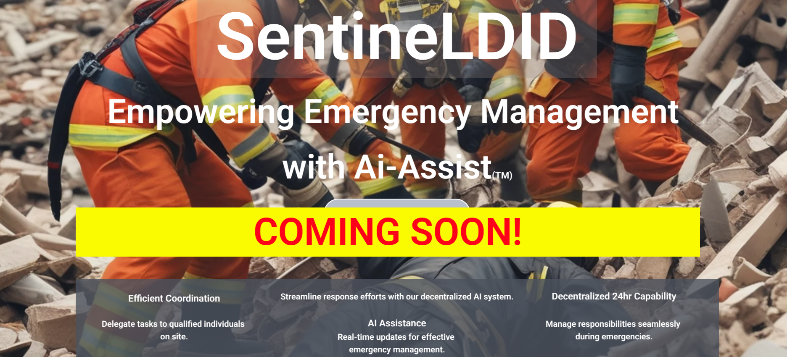

# ⚕️ [SentinelDID](https://sentineldid.com): Decentralized Identity, Saving Lives

### Welcome to **SentinelDID**, a cutting-edge proof-of-concept for decentralized identity management. Used with the revolutionary SentinelDID Protocol<sup>TM</sup>, effortlessly manage user identities and suggested workflows for incredibly streamlined, efficient, and organized emergency services actions that are based on the real world knowledge and best standards in the industry.          <br><br>Built on the amazing, selective privacy protocol of [Midnight Testnet](https.//https://docs.midnight.network), SentinelDID showcases our privacy-first DID-NFT creation and ZKProof based verification for information about the user.    <br><br>Easily buildable, highly scalable emergency workforce management that revolutionizes heirarchical delegation, communication, and emergency workforce contact with effective, secure, and selectively private victim management. <br><br>Never wonder who is in charge, or where an individual is supposed to be. With Starlink and World Mobile integration, in tandem with smart phones or propriatary SentinelDID devices, no one gets left behind. <br><br>When victims are found those closest are alerted as well as the chain of command. <br><br>Gone are the days of searching for someone whos been found. Workforces are taken out of harms way or redirected to new victims in real time all while preserving the identity of the victims whether alive or otherwise. <br><br>Ground breaking "Downman switch" alerts superiors and team if someone is unresponsive or loses contact. <br><br>When better qualified leaders arrive on scene, the Ai assisted protocol passes the baton and automatically updates the entire workforces' heirarchy schema. <br><br>All delegations, workloads, and Ai assistance must be approved and may be modified in real time for fast effective leadership. <br><br>Volunteers can quickly join the workforce with just their KYC and a smart phone. <br><br>Rescuers always know who they report to, where those individuals are, and wht they themselves are tasked with.      <br><br>Superiors, subordinates, victims, and their families—all protected, all in contact, in real time.     <br><br>The future is now for emergency response actions.<br>Crisis management will never be the same. Join us on this journey to save lives...  ### 

---


# SentinelDID PoC

**This is the main repo for the DID Hackathon for Midnight for the SentinelDID Proof of Concept (PoC).**



## Workflow for SentinelDID PoC

- **User Enters KYC:** Form submission in `index.html` → processed by `server.js`.
- **KYC Stored Locally:** Data stored in `kycStore` → hashed into `kycHash`.
- **Mint NFT:** `kycHash` sent to Midnight Testnet → stored in `didNFTs` → public `didId` generated.
- **QR Code Generation:** `didId` linked to a QR code → displayed for user.
- **Privacy Protection:** `kycHash` stored privately in `didNFTs` → Proof server secures it.
- **ZKProof Verification:** Verifier requests proof via `verifyAge` → private proof generated → result validated.

## Recap of SentinelDID PoC Workflow

| Step                     | Description |
|--------------------------|-------------|
| **User Enters KYC**      | Form → `server.js` |
| **KYC Stored Locally**   | `kycStore` → hashed to `kycHash` |
| **Mint NFT**             | `kycHash` → `didNFTs` → public `didId` |
| **QR Code**              | `didId` → QR → user |
| **Privacy Protection**   | `kycHash` remains hidden, proof server ensures security |
| **ZKProof Verification** | Verifier → `verifyAge` → private proof → result |

## **🚀 Starting the Application**

To launch the SentinelDID form and backend services, execute this command from the root directory (`/SentinelDID-poc`):

yarn turbo run start

## **🚀 What Happens When You Start?**

Fire up the engines with `yarn turbo run start`—here’s the magic it unleashes:

- **🔧 Backend API**:  
  Ignites `server.js` in `sentineldid-api-folder`—powers DID minting and zero-knowledge proof (ZKP) verification like a pro!

- **🎨 Frontend UI**:  
  Serves `index.html` from `sentineldid-ui-folder`—your sleek portal to decentralized identity management.

- **🔗 Seamless Connection**:  
  Links the frontend and backend for a flawless, smooth-as-silk experience.

---

## **🌐 Accessing the App**

- **Auto-Launch**:  
  Once the server’s humming, your default browser should pop open the app—ready to roll!

- **Manual Navigation**:  
  No auto-open? No sweat—point your browser to:  
  **`http://localhost:3000`**  
  *(Tweak the port if you’ve customized it—3000’s the default!)*

---

## **🛑 Stopping the Program**

Need to dock the ship? Easy peasy!

- **In the Terminal**:  
  Hit **`CTRL + C`** where the app’s running—shuts it down faster than a blink.

### **Restarting**
- Ready to sail again? Just rerun:  
  ```bash
  yarn turbo run start

  📌 Additional Notes
Setup Checklist
Dependencies:
Run yarn install first—grabs all the goodies (express, ethers, etc.) for a smooth launch!
Port Check:
Hiccups? Ensure ports (e.g., 3000) are free—peek with netstat -tulnp | grep 3000.
Debugging:
Spy on terminal logs—your trusty co-pilot for error hints!
Pro Tip
Watch sentineldid-api-folder/server.js—update contractAddress after deploying to Midnight Testnet for that extra ✨ magic!
🌟 Enjoy SentinelDID!
Dive into decentralized identity with SentinelDID—mint DIDs, link via Lace wallet, and verify with ZKPs. Built with ❤️ for privacy and innovation. Happy hacking, captain! 🚀


